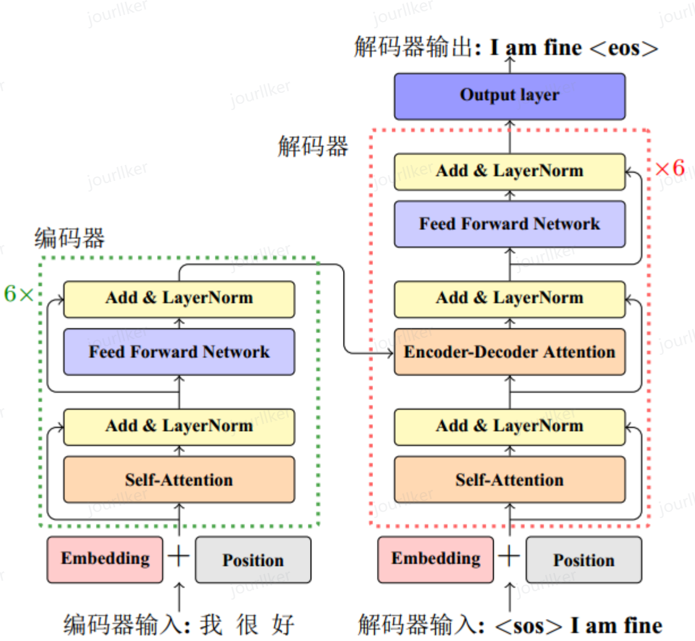

# 基于transformer的机器翻译

## transformer诞生的由来
循环或卷积神经网络的序列到序列建模方法，在建模文本长程依赖方面都存在一定的局限性。
循环神经网络：由于所有的前文信息都蕴含在一个隐向量里面，这会导致随着序列长度的增加，编码在隐藏状态中的序列早期的上下文信息被逐渐遗忘。
卷积神经网络：受限的上下文窗口在建模长文本方面天然地存在不足。如果需要关注长文本，就需要多层的卷积操作。

## 优势
完全通过注意力机制完成对源语言序列和目标语言序列全局依赖的建模。这是一种可以高并行的结构，大大增加了计算效率。

## 基本架构示意图

1. 嵌入层
将token转化为向量表示。
这个过程中，会在词嵌入中加入位置编码（Positional Encoding）。位置编码使用不同频率的正余弦函数：

其中，$pos$ 表示单词所在的位置，$2i$ 和 $2i+1$ 表示位置编码向量中的对应维度，$d$则对应位置编码的总维度。
>上述方式编码的好处：
>- 首先，正余弦函数的范围是在 $[-1,+1]$，导出的位置编码与原词嵌入相加不会使得结果偏离过远而破坏原有单词的语义信息。
>- 其次，依据三角函数的基本性质，可以得知第$pos+k$ 个位置的编码是第 $pos$ 个位置的编码的线性组合，这就意味着位置编码中蕴含着单词之间的距离信息。

2. 自注意力层
引入在注意力机制中：查询 $q_{i}（Query）$ ，键 $k_{i}（Key）$ ，值 $v_{i}（Value）$ 。在编码输入序列中每一个单词的表示的过程中，这三个元素用于计算上下文单词所对应的权重得分。
所谓自注意力就是Q\K\V的值都是输入序列本身。为了防止过大的匹配分数在后续 Softmax 计算过程中导致的梯度爆炸以及收敛效率差的问题，这些得分会除放缩因子 $\sqrt{d} $ 以稳定优化。放缩后的得分经过 Softmax 归一化为概率之后，与其他位置的值向量相乘来聚合希望关注的上下文信息，并最小化不相关信息的干扰。

其中 $Q \in R^{L\times d_{q}}$, $K \in R^{L\times d_{k}}$, $V \in R^{L\times d_{v}}$分别表示输入序列中的不同单词的  $q,k,v$向量拼接组成的矩阵，L 表示序列长度， $Z \in R^{L\times d_{v}}$表示自注意力操作的输出。

3. 前馈层
就是一个线性层。

实验结果表明，增大前馈子层隐状态的维度有利于提升最终翻译结果的质量，因此，前馈子层隐状态的维度一般比自注意力子层要大。

4. 残差连接
残差连接主要是指使用一条直连通道直接将对应子层的输入连接到输出上去，从而避免由于网络过深在优化过程中潜在的梯度消失问题。

5. 层归一化

其中 $\mu$  和 $\sigma$ 分别表示均值和方差，用于将数据平移缩放到均值为 0，方差为 1 的标准分布，$a$  和  $b$ 是可学习的参数。层归一化技术可以有效地缓解优化过程中潜在的不稳定、收敛速度慢等问题。
目的：为了进一步使得每一层的输入输出范围稳定在一个合理的范围内。
